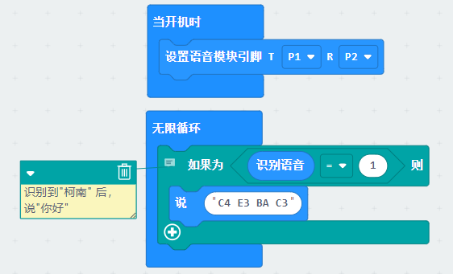
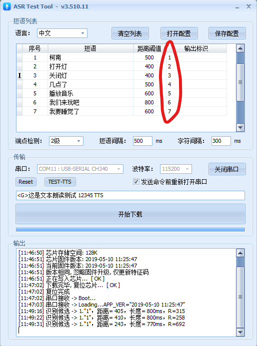
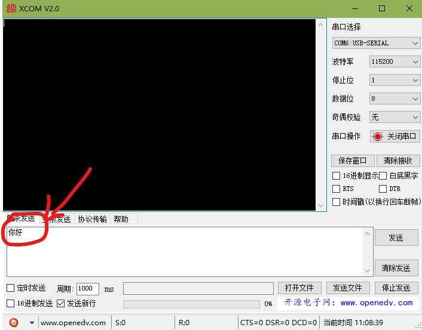
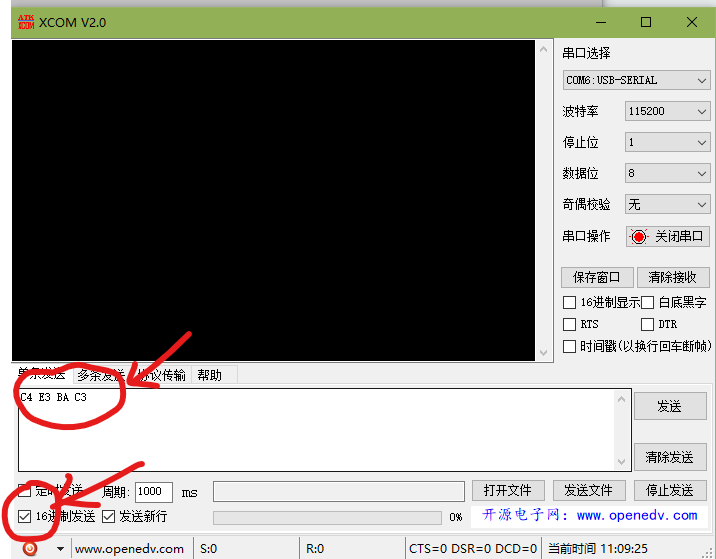
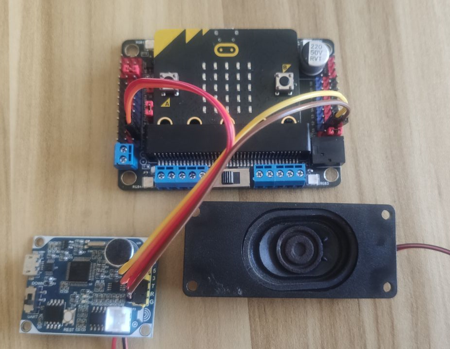

# pxt-speech

A driver of SX-ASR-A speech module in MakeCode.

## Example 

```typescript
speech.setPin(SerialPin.P1, SerialPin.P2)
basic.forever(function () {
    // 识别到"柯南" 后，
    // 说"你好"
    if (speech.hear() == 1) {
        speech.say("C4 E3 BA C3")
    }
})
```

## Example(Block)



## Setting



## Translate chinese to GBK code





## Connection



## Tools

- ASRTool

  SX-ASR-A speech module tool

- XCOM V2.0

  Translate tool

## License

MIT

## Supported targets

* for PXT/microbit
  (The metadata above is needed for package search.)

